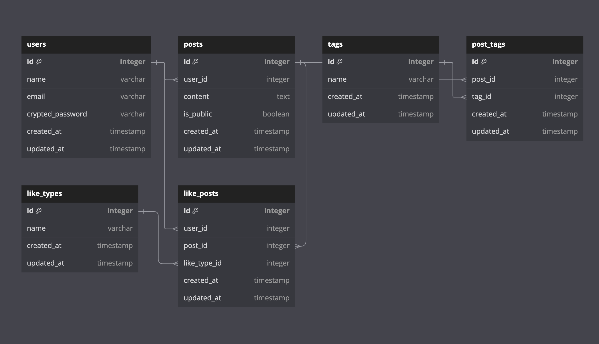

# Empatia

# サービス概要
ユーザーが匿名で共感を得たり、他者に共感することができるアプリです。  
SNSや他のコミュニケーションアプリとは異なり、このアプリではユーザー同士の直接的なつながりがありません。  
純粋に共感の共有に焦点を当てています。  

# このサービスへの思い・作りたい理由
私はSNSをよく利用しています。繋がりのある人以外の投稿もよく目にしましたが、他者の投稿に対して心ないコメントを見かけることが多々ありました。  
そういったコメントを見るたびになんとも言えない気持ちになり、特に投稿内容とは関係のない投稿者の人格や在り方を否定するようなコメントや、見えている一部分だけを勝手に解釈して不特定多数の人が見る場所に書き込む様子を見ると、残念に思いました。  
これをきっかけに、偏見や差別のない共感を得られるアプリを作りたいと思うようになり、個人的な悩みや感情を共有する際に、自分の身元が特定される心配なく自由に発言できる場所が必要だと感じました。
このアプリを作るきっかけとなったのは、まさにその思いからです。　　
この匿名性は、利用者に対する心理的な負担を低くし、より多くの人が気軽に利用できるようにするために重要な要素だと考えています。

# ユーザー層について
ただ純粋に共感を求め、共感を提供することができる場所を求めている人。  
気軽に自分の本音や感情を共有し、他者からの共感を得られる場所を求めている人。  

# サービスの利用イメージ
ユーザーは匿名で自分の感じていることや考えを投稿し、他のユーザーの投稿に共感を示すことができます。  
コメント機能を設けず、シンプルに共感を示すだけのやり取りにすることで、深いコミュニケーションや議論が発生することがありません。  
ユーザー登録時には個人情報の入力を最低限に抑え、ユーザー名やプロフィール画像も不要とし、完全匿名で利用することができます。  
投稿やリアクションには一切の個人情報が表示されず、全てのユーザーが平等に共感を求め、提供できる環境です。  
また、フォロー機能やメッセージ機能などユーザー同士が直接つながる機能がないので、全ての投稿はランダムに表示されます。  
なのでユーザーは他の投稿を探索し、共感することだけに集中できます。  
さらに、投稿には「悲しい」、「嬉しい」、「悩み」、「感謝」などの感情タグを付けることができ、ユーザーは共感したい感情に基づいて投稿をフィルタリングすることができます。  
コメント機能がない代わりに、感情に基づいた複数のいいね機能で共感を得ることができます。

# ユーザーの獲得について
SNSを用いた宣伝等  

# サービスの差別化ポイント・推しポイント
### コメント排除による安全な環境
共感を示すためのリアクション機能に特化し、コメント機能を排除しています。  
これにより、ユーザーがネガティブなコメントや批判にさらされることなく、安心して利用できる環境を整えます。    
ポジティブなやり取りのみを許容することで、健全なコミュニティを維持します。  

### ユーザー同士の繋がりが不要
ユーザー同士がフォローや友達リクエスト等を通じて直接繋がる必要がないため、SNS特有のフォロワー数やいいね数へのプレッシャーから解放されます。  
純粋に共感の共有に集中できるシンプルな設計が、他のSNSと大きく異なる点です。  

### 感情タグによる投稿フィルタリング
投稿に「悲しい」、「嬉しい」、「悩み」、「感謝」などの感情タグを付けることができ、ユーザーは自分が共感したい感情に基づいて投稿をフィルタリングできます。  
この機能により、ユーザーは自分の気持ちに合った投稿を簡単に見つけることができ、より深い共感体験を得ることができます。  

### 簡単かつ直感的な操作
複数のいいねボタンは視覚的に分かりやすく配置されており、ユーザーは簡単に直感的に操作できます。これにより、誰でも気軽に共感を示すことができ、ユーザー体験が向上します。  

# 機能候補
### 現状
- ユーザー登録機能
  - メール
  - パスワード

- ログイン機能
  - メール
  - パスワード

- 投稿機能
  - 作成
  - 編集
  - 削除
  - 公開・非公開

- いいね機能(追加あり)
  - 嬉しい
  - 怒る
  - 悲しい
  - 楽しい
  - 応援(がんばれ)
  - 感謝
  - 驚き
  - 考える
  - 分かる(共感)
  - 素晴らしい
 
- タグ検索機能

### MVP
- つぶやきのランダム投稿表示機能

### 本リリース
- レスポンシブデザイン

# 機能の実装方針予定
今の所はLINE通知機能: LINE Messaging APIを予定していますが、ユーザー登録機能とログイン機能をGoogle認証にするかで変更します。  
(いいねがついた時の通知としてLINE通知機能を使うか、ログイン機能をGoogle認証にするかで検討中です。)

# 使用予定の技術スタック
| カテゴリ | 技術 |
| --- | --- |
| 開発環境 | Docker |
| フロントエンド | HTML / CSS / JavaScript |
| バックエンド | Rails 7.1.3.2 (Ruby 3.2.2 ) |
| データベース | MySQL2 |
| インフラ | Heroku |
| Web API | Google OAuth 2.0 API または LINE Messaging API |

# 画面遷移図
[画面遷移図](https://www.figma.com/design/NwasnzHU8AJUFSiIa6SBPg/Empatia?node-id=0-1&t=uaA2LspzBDUCsqhL-1)

# ER図
### [ER図](https://gyazo.com/1254a680c4e85dde4ad9dcc2c1ac6a14)

- usersテーブル(ユーザー情報をもつテーブル)
  - id : ユーザーID(主キー)
  - name : 名前
  - email : メールアドレス
  - crypted_password : パスワード
  - created_at : 作成日時
  - updated_at : 更新日時

- postsテーブル(ポストの情報をもつテーブル)
  - id : ポストID(主キー)
  - user_id : ユーザーID(外部キー)
  - content : 内容
  - is_public : 公開・非公開のフラグ
  - created_at : 作成日時
  - updated_at : 更新日時

- tagsテーブル(タグの情報をもつテーブル) 
  - id : タグのID(主キー)
  - name : タグの名前
  - created_at : 作成日時
  - updated_at : 更新日時

- post_tagsテーブル(ポストタグの情報をもつテーブル/中間テーブル)
  - id : ポストタグID(主キー)
  - post_id : ポストID(外部キー)
  - tag_id : タグID(外部キー)
  - created_at : 作成日時
  - updated_at : 更新日時

- like_typesテーブル (いいねの種類の情報をもつテーブル)
  - id : いいねの種類のID (主キー)
  - name : いいねの種類名 (例: "嬉しい", "悲しい", "怒る" など)
  - created_at : 作成日時
  - updated_at : 更新日時

- like_postsテーブル(いいねの情報をもつテーブル)
  - id : いいねのID(主キー)
  - user_id : ユーザーID(外部キー)
  - post_id : ポストID(外部キー)
  - like_type_id : いいねの種類のID (外部キー)
  - created_at : 作成日時
  - updated_at : 更新日時

- テーブル間のリファレンス(外部キーの定義)
  - posts.user_id は users.id を参照
  - post_tags.post_id は posts.id を参照
  - post_tags.tag_id は tags.id を参照
  - like_posts.user_id は users.id を参照
  - like_posts.post_id は posts.id を参照
  - like_posts.like_type_id は like_types.id を参照